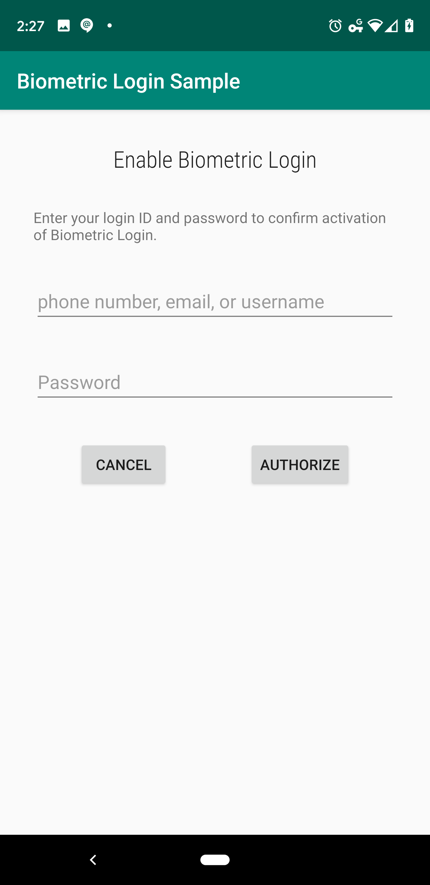

Android BiometricLogin Sample (Kotlin)
=========================================

Sample for the Androidx Biometrics Library

Introduction
------------

This is the canonical sample that demonstrates how to integrate Android Biometrics into your apps.
Whether your project is for government, healthcare, financial, enterprise, or general usage, this
sample should guide your implementation.

What the sample does
--------------------
The sample app addresses the following critical user journeys:
1. How to enable biometric login in your app.
2. How to handle the server token for subsequent biometric login.
3. How to actually login with biometric and release the server token for communication with the server.

What this sample does not do
----------------------------
- This sample does **not** teach you how to handle server side authentication
- This sample does **not** teach you how to communicate with your servers

Suggested Reading
-----------------

- [One Biometric API Over all Android](https://android-developers.googleblog.com/2019/10/one-biometric-api-over-all-android.html)
- [Migrating from FingerprintManager to BiometricPrompt](https://medium.com/androiddevelopers/migrating-from-fingerprintmanager-to-biometricprompt-4bc5f570dccd)
- [Using BiometricPrompt with CryptoObject: How and Why](https://medium.com/androiddevelopers/using-biometricprompt-with-cryptoobject-how-and-why-aace500ccdb7)

Screenshots
-----------

Getting Started
---------------

This sample uses the Gradle build system. To build this project, use the
"gradlew build" command or use "Import Project" in Android Studio.

Support
-------

- Stack Overflow: https://stackoverflow.com/questions/tagged/android-biometric

If you've found an error in this sample, please file an issue:
https://github.com/android/security

Patches are encouraged, and may be submitted by forking this project and
submitting a pull request through GitHub. Please see CONTRIBUTING.md for more details.
