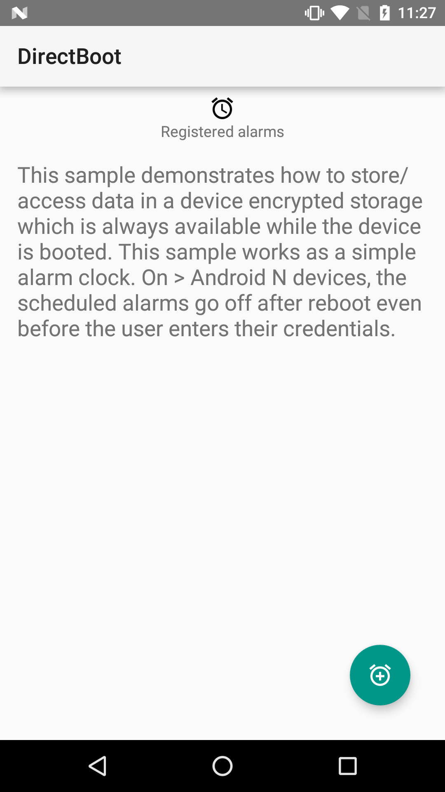
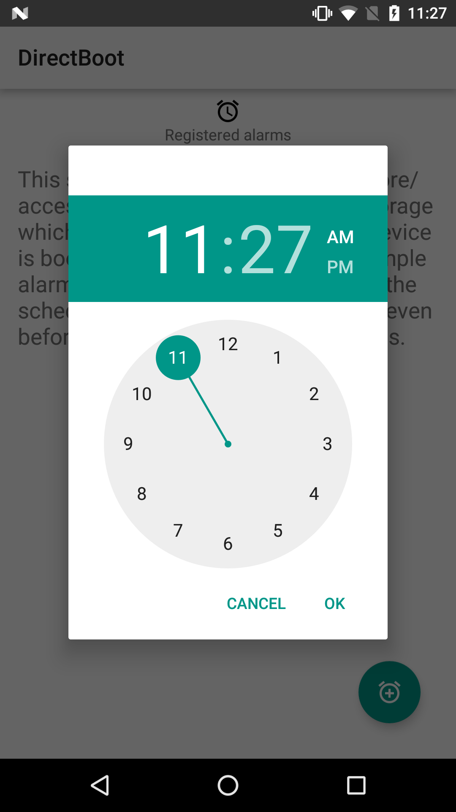
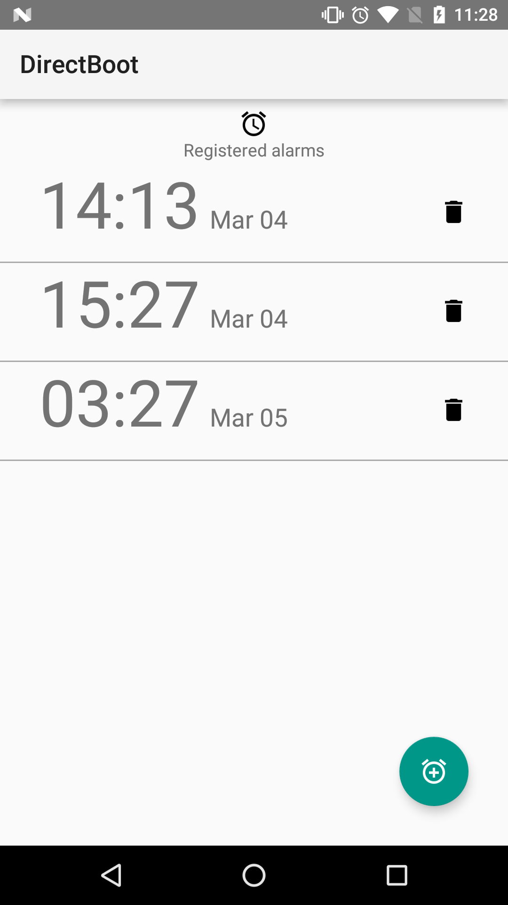
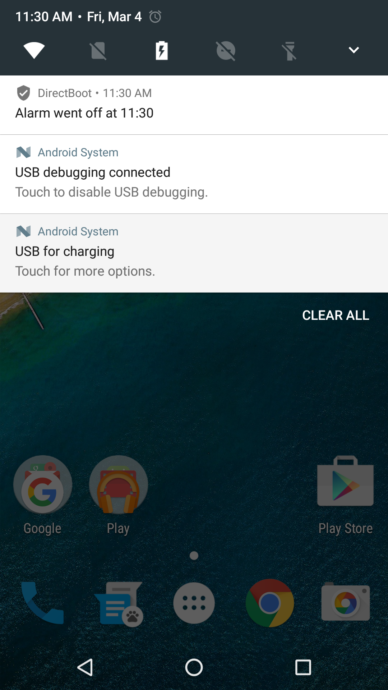

Android DirectBoot Sample
===================================

Sample demonstrating how to store data in a device protected storage which
is always available while the device is booted both before and after any
user credentials(PIN/Pattern/Password) are entered.

Introduction
------------

This sample demonstrates how to store and access data in a device protected
storage which is always available while the device is booted.
Starting from Android N, the system provides two storage locations for user data:

- Credential protected:
    - The default storage location for all apps, available only after the user has entered their pattern/password

- Device protected:
    - A new storage location which is always available while the device is booted, both before and after any user credentials are entered

Apps can mark individual components as being direct boot aware which indicates to the system that they can safely run when
Credential protected storage is unavailable (an direct boot aware component primarily relies on data stored in the new Device protected storage area,
but they may access Credential protected data when unlocked) by adding `directBootAware="true"` in the manifest.
```
<activity|provider|receiver|service ...
android:directBootAware=”true”>
```

Components marked as directBoot aware are normal components that will continue to be available after the
Credential protected storage becomes available. The storage APIs on the Context supplied to these components will always point to Credential protected storage by default.
To access Device protected storage, you can create a secondary Context using this API
```
Context.createDeviceProtectedStorageContext()
```
All of the storage APIs on this returned Context will be redirected to point at Device protected storage.

You need to be careful what data is stored/moved to a device protected storage
because the storage isn't protected by the user's credential (PIN/Pattern/Password)
You shouldn't store sensitive data (such as user's emails, auth tokens) in a
device protected storage.

Pre-requisites
--------------

- Android SDK 28
- Android Build Tools v28.0.3
- Android Support Repository

Screenshots
-------------

    

Getting Started
---------------

This sample uses the Gradle build system. To build this project, use the
"gradlew build" command or use "Import Project" in Android Studio.

Support
-------

- Google+ Community: https://plus.google.com/communities/105153134372062985968
- Stack Overflow: http://stackoverflow.com/questions/tagged/android

If you've found an error in this sample, please file an issue:
https://github.com/googlesamples/android-DirectBoot

Patches are encouraged, and may be submitted by forking this project and
submitting a pull request through GitHub. Please see CONTRIBUTING.md for more details.

License
-------

Copyright 2019 The Android Open Source Project, Inc.

Licensed to the Apache Software Foundation (ASF) under one or more contributor
license agreements.  See the NOTICE file distributed with this work for
additional information regarding copyright ownership.  The ASF licenses this
file to you under the Apache License, Version 2.0 (the "License"); you may not
use this file except in compliance with the License.  You may obtain a copy of
the License at

http://www.apache.org/licenses/LICENSE-2.0

Unless required by applicable law or agreed to in writing, software
distributed under the License is distributed on an "AS IS" BASIS, WITHOUT
WARRANTIES OR CONDITIONS OF ANY KIND, either express or implied.  See the
License for the specific language governing permissions and limitations under
the License.
