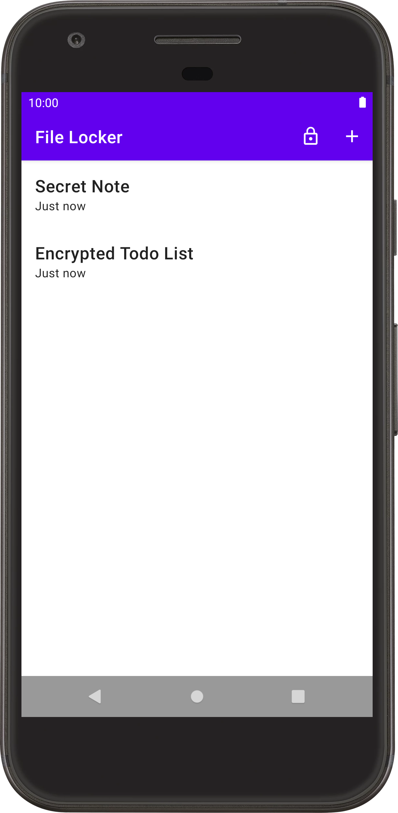

File Locker Sample
==================

A sample that demonstrates how to use the Jetpack Security library to encrypt and decrypt files by
implementing a simple note taking app.

Introduction
------------

This sample shows how to implement based file and shared preferences encryption using the
[Jetpack security library][1].

The sample shows how to use [`EncryptedFile`][2] to securely store notes, as well as using
[`EncryptedSharedPreferences`][3] to store a "master password" that must be entered before
notes can be viewed or edited.

Pre-requisites
--------------

- Android SDK 29
- Jetpack Security Library

Getting Started
---------------

This sample uses the Gradle build system. To build this project, use the
"gradlew build" command or use "Import Project" in Android Studio.

Support
-------

- Stack Overflow: [http://stackoverflow.com/questions/tagged/android][4]

If you've found an error in this sample, please file an issue:
https://github.com/android/security

Patches are encouraged, and may be submitted by forking this project and
submitting a pull request through GitHub. Please see CONTRIBUTING.md for more details.

[1]: https://developer.android.com/topic/security/data.md
[2]: https://developer.android.com/reference/androidx/security/crypto/EncryptedFile
[3]: https://developer.android.com/reference/androidx/security/crypto/EncryptedSharedPreferences
[4]: http://stackoverflow.com/questions/tagged/android
