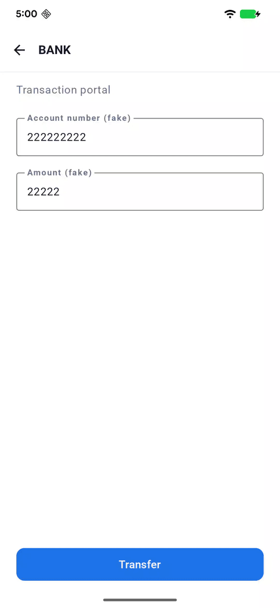
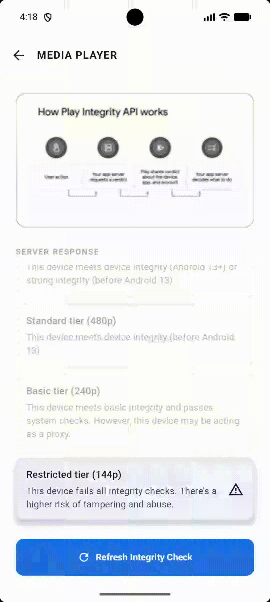
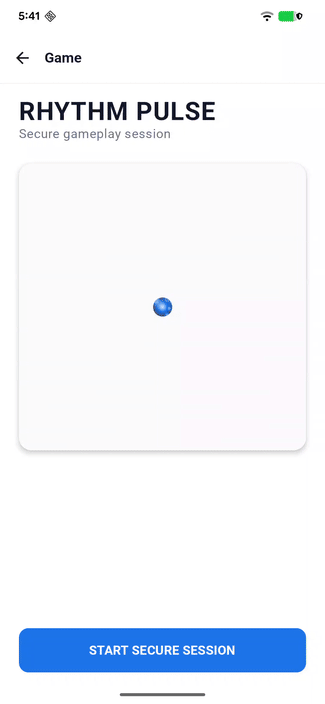
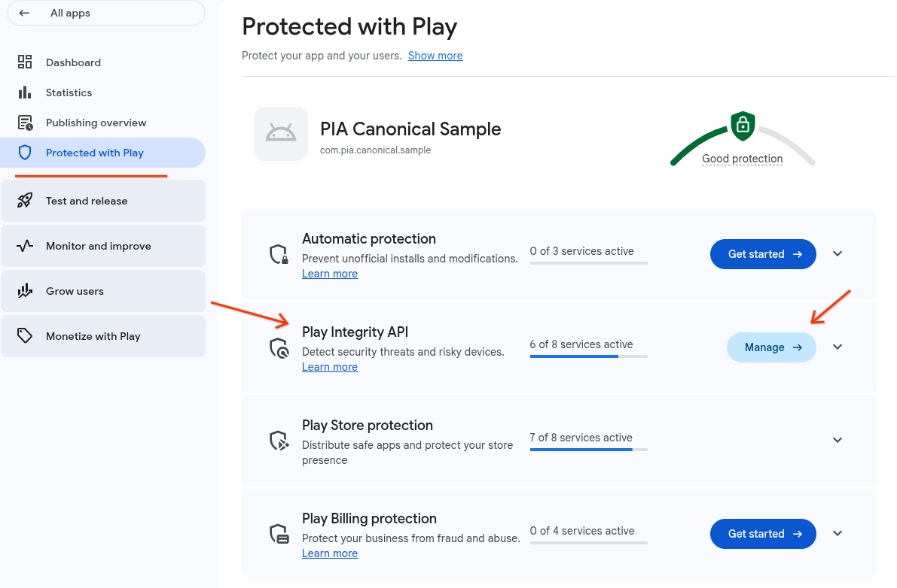
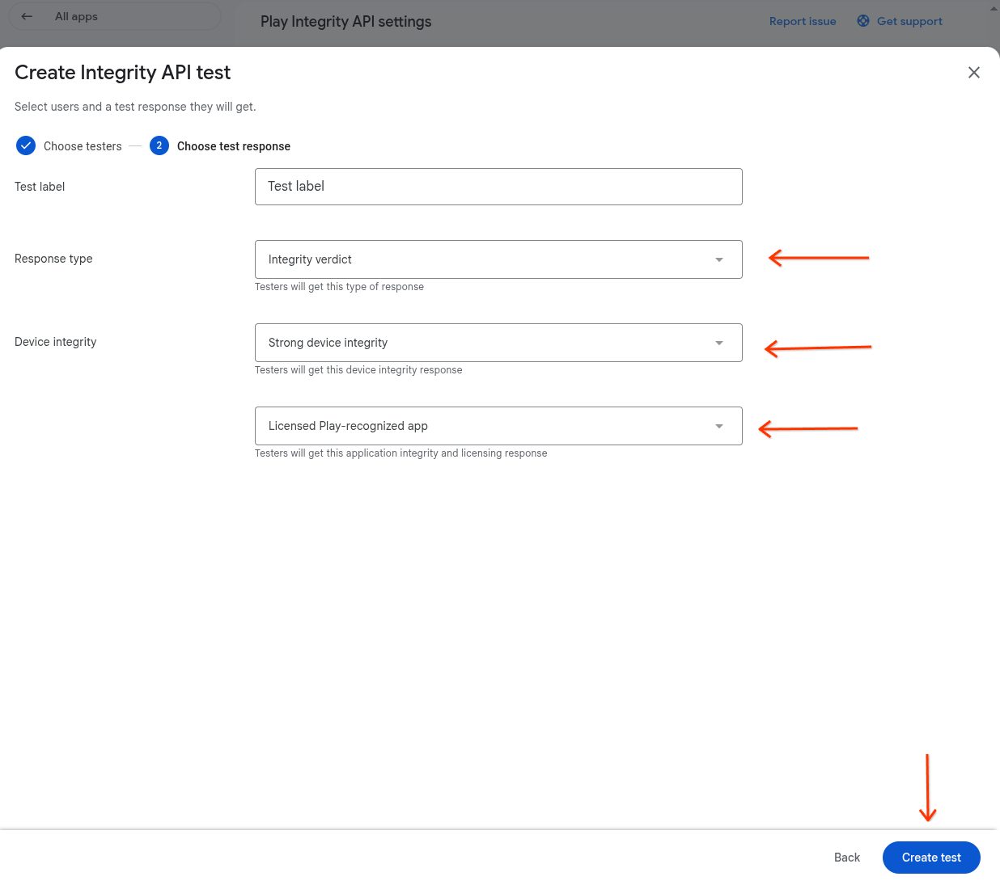

# Play Integrity API: E2E Sample app

> [!NOTE] 
> Disclaimer: Non-Goals
>
> This project is designed for demonstration and educational purposes to provide
> a blueprint for technical integration. It is not the goal of this sample app
> to provide a production-ready anti-abuse strategy.
>
> While the sample demonstrates best practices for token handling and
> server-side verification, it is not a substitute for a comprehensive security
> audit. Developers should treat the Play Integrity API as one signal within a
> broader, multi-layered anti-abuse strategy tailored to their specific business
> risks.

> [!WARNING]
> Security Notice: Cleartext HTTP in Development
>
> Across the Android client, interactions rely on a dynamically configured base URL
> (`BuildConfig.BASE_URL`) that points to a local Node.js server using unencrypted HTTP
> (e.g., `http://localhost:3000` or `http://10.0.2.2:3000`). This is an intentional design choice
> for this sample to minimize setup complexity and ensure frictionless onboarding, avoiding the
> need to generate and configure self-signed SSL/TLS certificates locally.
>
> **This configuration is strictly for local deployment.** When integrating these
> concepts into your own production app, you **should** secure your network layer by using
> secure HTTPS (`https://`) and avoid having cleartext permissions in your
> `network_security_config.xml`.

# Setup

To run the Play Integrity API Canonical Sample end-to-end, you need to configure
a Google Cloud project, register your app in the Google Play Console, and set up
both the local Node.js server and the Android client.

### Prerequisites

*   [Node.js](https://nodejs.org/en) v18 or higher installed.
*   The latest version of [Android Studio](https://developer.android.com/studio)
    installed.
*   A Google Play Developer account.
*   A Google Cloud account.

## Step 1: Configure Google Cloud & Play Console

First, establish the connection between your Google Cloud project and your
Google Play app entry.

1.  Open the [Google Cloud Console](https://console.cloud.google.com/) and
    create a new project.
2.  Navigate to **APIs & Services** \> **Library**, search for the **Google Play
    Integrity API**, and click **Enable**.
3.  Open the [Google Play Console](https://play.google.com/console/) and create
    a new app entry.
    *   *Note: Choose your package name carefully. You will use this exact
        package name to configure both the Android client and the Node.js server
        later.*
4.  In the Play Console left navigation menu, select **Protected with Play**,
    and then click **Get Started** on the **Play Integrity API** card.
5.  Follow the on-screen instructions to link the Google Cloud project you
    created in step 1\.
6.  Enable the population of the following
    [optional verdicts](https://developer.android.com/google/play/integrity/verdicts#optional-device-labels)
    within the same section:
    *   `MEETS_STRONG_INTEGRITY`
    *   `MEETS_BASIC_INTEGRITY`
    *   Device attributes
    *   App access risk
    *   Play Protect

## Step 2: Generate Service Account Credentials

Your local server needs credentials to securely communicate with Google Cloud.

1.  In the Google Cloud Console, navigate to **IAM & Admin** \> **Service
    Accounts**.
2.  Click **Create Service Account**. (Default settings are fine; no special
    roles are required).
3.  Click on your newly created Service Account, navigate to the **Keys** tab,
    and select **Add Key** \> **Create new key**.
4.  Select **JSON** as the key type and click **Create** to download the
    credentials file to your machine.

## Step 3: Download the Project

Clone the repository containing the sample code to your local machine.

```shell
git clone https://github.com/android/security-samples.git
cd security-samples
```

## Step 4: Local Server Setup

Configure and run the Node.js backend.

1.  Navigate to the server directory: `cd PlayIntegrityAPI/node-server`
2.  Install the required dependencies: `npm install`
3.  Move the downloaded JSON credentials file from Step 2 into the root of the
    `node-server` directory.
4.  Rename the file to `google-credentials.json`
    *   *Note: This filename is listed in `.gitignore` to prevent accidental
        credential leaks*
5.  Create a file named `.env` in the root of the `node-server` directory and
    define the following variables:
    *   `PACKAGE_NAME="com.your.package.name"` \# Use the package name of the
        Play Console app entry created in Step 1
    *   `GOOGLE_CREDENTIALS_PATH="./google-credentials.json"`
6.  Start the server: `node app.js`

## Step 5: Android Client Setup

Configure the Android app to communicate with your local server and your
specific Google Cloud project.

1.  Open the `PlayIntegrityAPI/android-client` directory using Android Studio
2.  Open the `local.properties` file in the project root and add your Google
    Cloud project number:
    *   `GCP_PROJECT_NUMBER=1234567890`
3.  Open the app-level `build.gradle.kts` file and update the `applicationId` to
    match the package name of the app entry you created in the Play Console.
4.  Sync your project with Gradle files.
5.  Select the `physicalRelease` variant from the Build Variants tool window,
    opened via the Tool Window bar on the far left of the Android Studio
    interface
6.  [Generate a signed Android App Bundle (AAB)](https://developer.android.com/studio/publish/app-signing)
    using Android Studio.
7.  In the Google Play Console,
    [set up an internal testing track](https://support.google.com/googleplay/android-developer/answer/9845334)
    and upload your signed AAB as a new release.
8.  Once the release is processed, use the internal testing link provided in the
    Play Console to install the app onto your physical test device.
9.  To allow the app on your device to communicate with your local machine's
    backend server, connect the device via USB and set up ADB reverse port
    forwarding in your terminal (replace `<SERVER_PORT>` with your Node server
    port, e.g., 3000, and `<CLIENT_PORT>` with the port number that the app
    tries to access, e.g. 3000): `adb reverse tcp:<CLIENT_PORT>
    tcp:<SERVER_PORT>`
    *   Note: once the device is disconnected, you will need to run this command
        again the next time you need to test this flow

# Banking Micro App

The Banking micro-app demonstrates how to securely parse HTTP requests,
cryptographically validate Play Integrity tokens, and enforce business rules.

<div align="center">
  
</div>

### User Journey Overview
When a user attempts to submit a secure transfer, the app requests an integrity token. If the device fails the integrity checks (e.g., a compromised device or unlicensed app), a remediation dialog prompts the user to resolve the issue (such as installing from Google Play). Upon successful remediation, the app retries the transaction securely.

## Client-Side Implementation
See the following files in `android-client/feature/bank`:
*   **Token preparation (warm-up) & Handling remediation:** [BankViewModel.kt](android-client/feature/bank/src/main/java/com/android/security/samples/playintegrityapi/feature/bank/ui/BankViewModel.kt)
*   **Request hash generation & Network execution:** [SubmitSecureTransferUseCase.kt](android-client/feature/bank/src/main/java/com/android/security/samples/playintegrityapi/feature/bank/domain/SubmitSecureTransferUseCase.kt)

## Server-Side Implementation
See the following files in `node-server/src/features/bank`:
*   **Cryptographic validation & Error formatting:** [bank.controller.js](node-server/src/features/bank/bank.controller.js)
*   **Business logic enforcement:** [bank.policy.js](node-server/src/features/bank/bank.policy.js)

--------------------------------------------------------------------------------

# Streaming Micro-App

The Streaming micro-app demonstrates how to parse standard integrity tokens,
enforce tiered access policies, and dynamically modify DASH XML manifests.

<div align="center">
  
</div>

### User Journey Overview
The user accesses video content, which requests an integrity token to determine their device's trust tier. Based on the returned token, the backend dynamically modifies the video manifest to serve either premium or restricted streams. A user on a verified device enjoys high-quality streaming, while an unrecognized environment receives degraded quality without outright blocking playback.

## Client-Side Implementation
See the following files in `android-client/feature/streaming`:
*   **ExoPlayer Network Injection & Dynamic Tiers:** [StreamingViewModel.kt](android-client/feature/streaming/src/main/java/com/android/security/samples/playintegrityapi/feature/streaming/ui/StreamingViewModel.kt)
*   **Request Hash Generation (Content Binding):** [GetSecureStreamingConfigUseCase.kt](android-client/feature/streaming/src/main/java/com/android/security/samples/playintegrityapi/feature/streaming/domain/GetSecureStreamingConfigUseCase.kt)

## Server-Side Implementation
See the following files in `node-server/src/features/streaming`:
*   **Token Decoding, Replay Protection & Content Binding:** [streaming.controller.js](node-server/src/features/streaming/streaming.controller.js)
*   **Tiered Access Policies:** [streaming.policy.js](node-server/src/features/streaming/streaming.policy.js)
*   **Dynamic DASH XML Filtering:** [manifest.service.js](node-server/src/features/streaming/manifest.service.js)

--------------------------------------------------------------------------------

# Game Micro-App

The Game sample showcases a stateful, secure verification pattern designed to defeat TOCTOU
(Time-of-Check to Time-of-Use) cheats, enforce strict environment policies, and securely evaluate
background Play Integrity API attestations.

<div align="center">
  
</div>

### User Journey Overview
Upon initiating a game session, a secure state is established on the server. While playing, the app performs background checks and sends periodic updates. If an anomaly is detected (like an attached debugger or a compromised environment), the game pauses and prompts the user for remediation. Once the environment is secure again, gameplay resumes, culminating in a securely validated final score submission.

## Client-Side Implementation
See the following files in `android-client/feature/game`:
*   **Session Initialization:** [InitiateGameUseCase.kt](android-client/feature/game/src/main/java/com/android/security/samples/playintegrityapi/feature/game/domain/InitiateGameUseCase.kt)
*   **TOCTOU Defence (Background Intervals) & Remediation:** [GameViewModel.kt](android-client/feature/game/src/main/java/com/android/security/samples/playintegrityapi/feature/game/ui/GameViewModel.kt)
*   **Session Stop & Final Submission:** [SubmitGameScoreUseCase.kt](android-client/feature/game/src/main/java/com/android/security/samples/playintegrityapi/feature/game/domain/SubmitGameScoreUseCase.kt)

## Server-Side Implementation
See the following files in `node-server/src/features/game`:
*   **Stateful Verification & TOCTOU Prevention:** [game.controller.js](node-server/src/features/game/game.controller.js)
*   **Environment Policy Rules:** [game.policy.js](node-server/src/features/game/game.policy.js)

--------------------------------------------------------------------------------------------

# Testing Play Console Integrity Responses

This section guides you through using the Play Integrity API test responses
feature in the
[Google Play Console](https://developer.android.com/distribute/console) to
dynamically alter the streaming quality in the sample app. This assumes you have
already completed the full end-to-end setup as described in the root project
guide (i.e. app created in Play Console, Play Integrity API enabled, Google
Cloud project linked, Node.js server running, Android app buildable).

#### Prerequisites

*   A Google Play Developer account.
*   Your app is set up in the Play Console.
*   Play Integrity API is enabled for your app and linked to your Google Cloud
    project.
*   The sample Node.js backend server is running.
*   The Android client app is installed and runnable on a device or emulator,
    signed in with a Google account.

#### Steps to Test Different Integrity Verdicts

1.  **Navigate to Play Integrity API Settings:**
    *   Open the Google Play Console.
    *   Select your application.
    *   In the Play Console left navigation menu, select **Protected with
        Play**.
    *   On the **Protected with Play** page, locate the **Play Integrity API**
        row and click the **Manage** button.



2.  **Configure Test Responses:**
    *   Scroll down to the Testing section.
    *   Click on Create new test.
    *   Give your test a descriptive name (e.g., "Device Unrecognized Test").
    *   Under Email lists, select or create an email list containing the Google
        account(s) used on your test device(s).
    *   Modify the Integrity verdicts to simulate different scenarios. For
        example:
        *   Premium Quality (Fully Trusted):
            *   `appRecognitionVerdict: PLAY_RECOGNIZED`
            *   `deviceRecognitionVerdict: [MEETS_DEVICE_INTEGRITY,
            MEETS_STRONG_INTEGRITY]`
            *   `appLicensingVerdict: LICENSED`
        *   Basic Quality (Basic Integrity):
            *   `appRecognitionVerdict: PLAY_RECOGNIZED`
            *   `deviceRecognitionVerdict: [MEETS_BASIC_INTEGRITY]`
            *   `appLicensingVerdict: LICENSED`
        *   Restricted Quality (No Device Integrity):
            *   `appRecognitionVerdict: UNEVALUATED`
            *   `deviceRecognitionVerdict: []` (Empty)
            *`appLicensingVerdict: UNEVALUATED`



3.  **Save the test configurations:**
    *   Click Create test. You might need to click Save changes at the bottom of
        the page too. Propagation time varies depending on multiple factors, but
        changes should be reflected in about 1-2 hours at the longest.
4.  **Observe in the Android App:**
    *   Open the Streaming micro-app on your test device (ensuring it's logged
        in to one of the accounts from the email list in the test
        configuration).
    *   The app might show a quality level based on a previous integrity check.
    *   Click the "Refresh Integrity Check" button within the app. This action
        forces the app to request a new Play Integrity token and DASH manifest.
    *   Play Integrity API will return a token with the verdicts you configured
        in the Play Console test.
    *   The Node.js server will decode this test token and return a DASH
        manifest filtered according to the tier mapped to the received verdicts.
    *   Observe the UI: The highlighted tier card ("Premium", "Standard", or
        "Restricted") should update, and the video playback quality will adjust
        after ExoPlayer reloads the manifest.

#### Example Scenarios to Try:

*   **Simulate a Rooted/Compromised Device:** Set `deviceRecognitionVerdict` to
    be empty. The stream should degrade to the "Restricted" tier.
*   **Simulate an Unlicensed User:** Set `appLicensingVerdict` to `UNLICENSED`.
    The stream should also degrade to the "Restricted" tier.
*   **Simulate a Fully Trusted Device & Licensed User:** Ensure verdicts are
    `MEETS_STRONG_INTEGRITY`, `PLAY_RECOGNIZED`, and `LICENSED`. The stream
    should allow "Premium" quality.

By changing the test responses in the Play Console and using the "Refresh
Integrity Check" button, you can effectively test how the end-to-end integration
handles various Play Integrity API outcomes and confirm that the stream quality
adjusts dynamically as expected.

